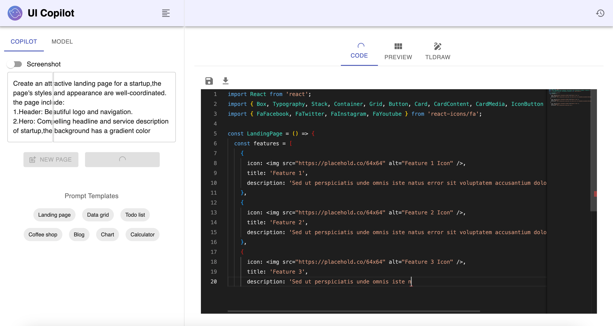
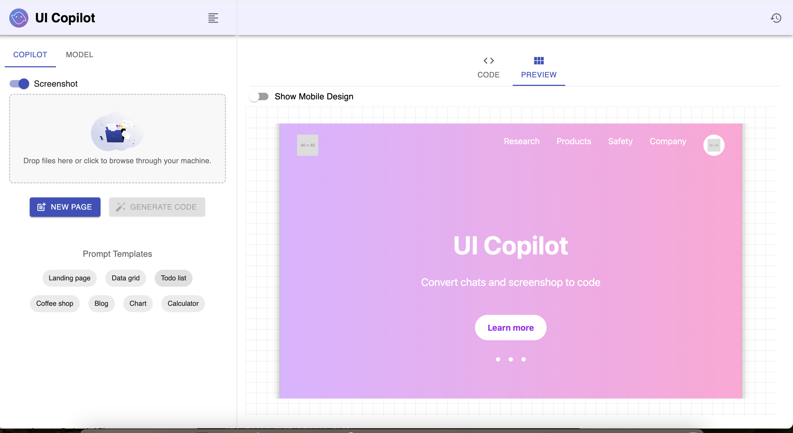
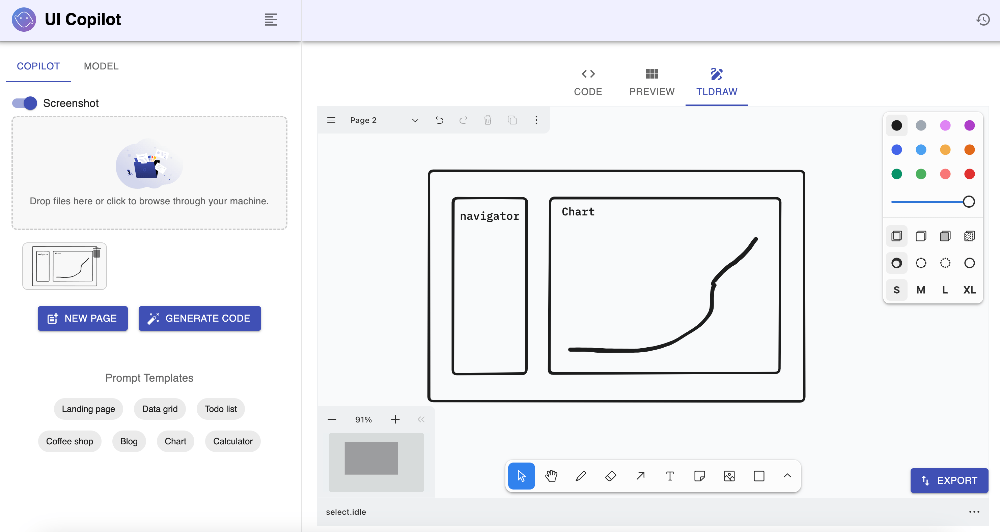

# -AI React Studio

**Developed by Devanshu Dudhia**

**-AI React Studio** is an AI-powered React UI generation platform that transforms **text prompts**, **screenshots**, and **Figma designs** into clean, production-ready React applications. Powered by **Claude on Amazon Bedrock**, it supports conversational UI refinement, enabling developers to iteratively generate, modify, and enhance interfaces with natural language. The project is fully **Dockerized** for seamless local development and deployment.

### ✨ Features

- 🤖 **AI-powered UI generation** using Claude on Amazon Bedrock
- 💬 **Conversational editing** for continuous UI refinement
- 📝 **Text-to-Code** generation
- 📸 **Screenshot-to-Code** conversion
- 🎨 **Figma-to-Code** generation
- ⚛️ **Production-ready React** component generation
- 🎯 Multiple UI stacks including **Tailwind CSS**, **Material UI**, **Mermaid**, and **Plotly**
- 🐳 **Docker** support for easy setup and deployment

### Text to Code



### Screenshot to Code



### Tldraw to Code



### Demo

https://github.com/user-attachments/assets/a77d428f-ce29-4f0a-b692-d983fdb02258

## Supported Stacks

- React + Material UI
- React + Tailwind CSS
- React + Mermaid
- React + Plotly

## Prerequisites

- Node.js (v18+)
- Docker (optional, recommended)
- Git (optional)
- Anthropic API key or AWS account credentials

## Setup

1. Clone the repository:

```sh
git clone https://github.com/Devanshudd/ai-react-studio.git
cd ai-react-studio
```

2. Configure API credentials:

```sh
cd server
cp .env.example .env
```

3. Update the `.env` file:

- Set `ANTHROPIC_API_KEY` **or** AWS credentials.
- Set `IS_DOCKER_ENV=true` when using Docker.

```env
IS_DOCKER_ENV=true
ANTHROPIC_API_KEY=
AWS_ACCESS_KEY_ID=
AWS_SECRET_ACCESS_KEY=
AWS_REGION=us-east-1
```

## Quick Start

### With Docker (Recommended)

From the project root:

```sh
docker-compose up -d --build
```

### Without Docker

```sh
# Install frontend dependencies
cd frontend
npm install --legacy-peer-deps
npm run dev

# Install backend dependencies
cd ../server
npm install
npm run dev
```

Open your browser and visit **http://localhost:9000**.

## TODO

- [ ] Support additional LLM providers (e.g., GPT-4, Ollama)
- [ ] Extend component generation to Angular and other frontend frameworks
- [ ] Generate complete multi-page React applications
- [ ] Export generated projects as ZIP files
- [ ] Add authentication and project history
- [ ] One-click deployment support
